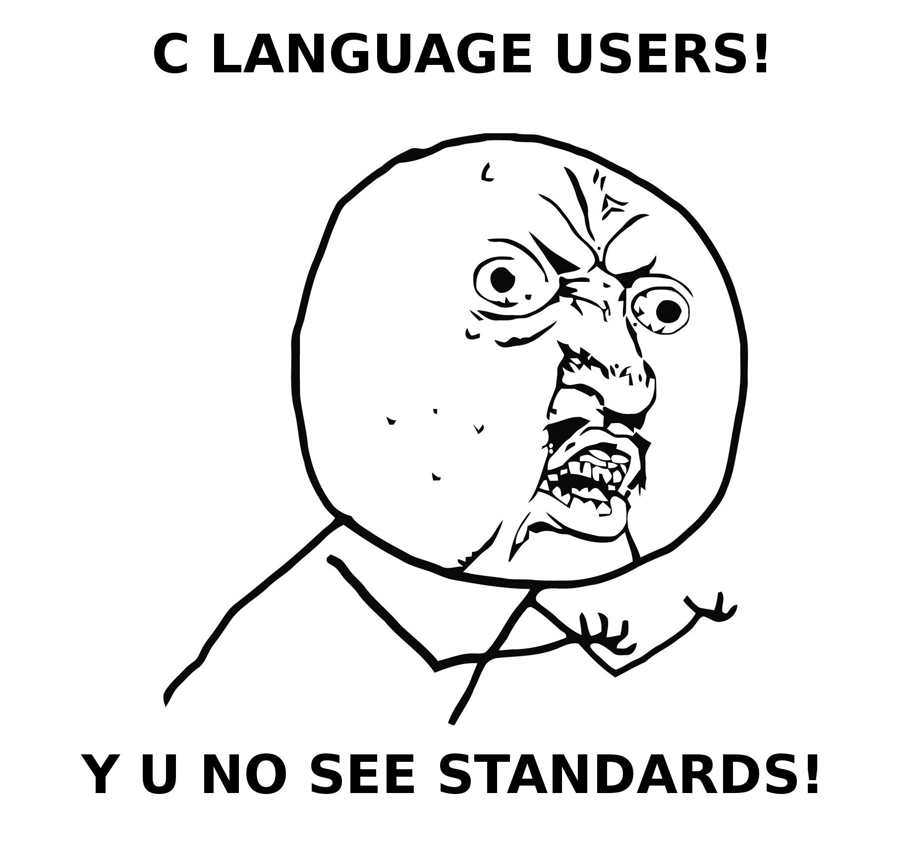

# C - File Input/Output (I/O)

## Tasks

0. Tread lightly, she is near. / Read and Print out
	- Write a function that reads a text file and prints it to the POSIX standard output.

1. Under the snow. / File Creation
	- Create a function that creates a file.

2. Speak gently, she can hear / Text Append.
	- Write a function that appends text at the end of a file.

3. cp / Copy Files
	- Write a program that copies the content of a file to another file.

> C combines all the power of assembly language with the ease-of-use of assembly language.
>
> _Mark Pearce_

